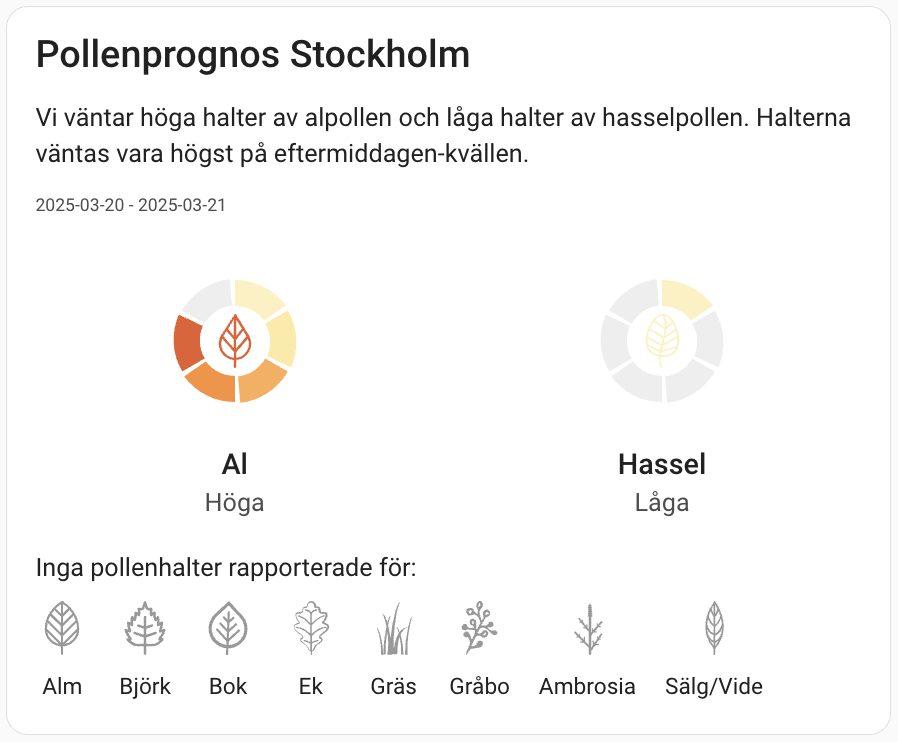
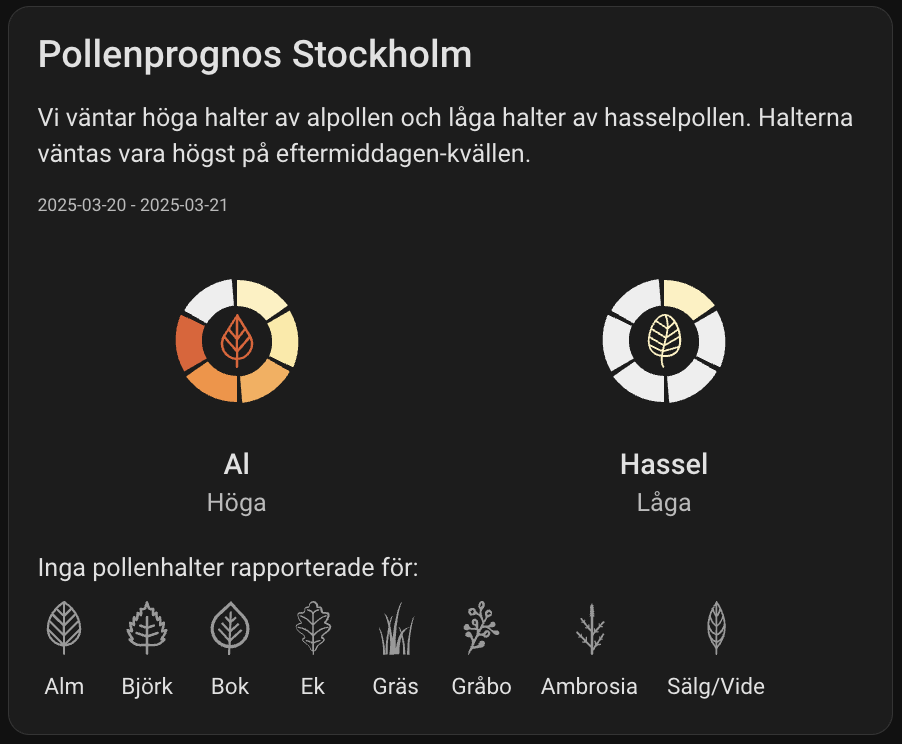

# Pollenpulsen Card

A custom card for Home Assistant that displays pollen forecasts from Pollenpulsen.




## Installation

### HACS (recommended)
1. Open HACS in Home Assistant
2. Go to "Frontend"
3. Click the three dots in the upper right corner
4. Select "Custom repositories"
5. Add this repository URL with category "Lovelace"
6. Search for "Pollenpulsen Card"
7. Click "Download"
8. Restart Home Assistant

### Manual Installation
1. Download `pollenpulsen-card.js` from the latest [release](https://github.com/YOUR_GITHUB/pollenpulsen-card/releases)
2. Copy the file to `config/www/` in your Home Assistant installation
3. Add the following to your `configuration.yaml`:

```yaml
lovelace:
  resources:
    - url: /local/pollenpulsen-card.js
      type: module
```

## Configuration

### Card Options

| Name | Type | Default | Description |
|------|------|---------|-------------|
| `type` | string | **Required** | `custom:pollenpulsen-card` |
| `entity` | string | **Required** | Pollenpulsen sensor entity |
| `show_header` | boolean | `true` | Show header |
| `show_forecast` | boolean | `true` | Show forecast text |
| `show_period` | boolean | `true` | Show forecast period |
| `show_charts` | boolean | `true` | Show pollen charts |
| `show_all_charts` | boolean | `false` | Show charts for all pollen types (including inactive) |
| `show_pollen_icon` | boolean | `true` | Show pollen icons in charts |
| `show_inactive_summary` | boolean | `true` | Show summary of inactive pollen types |

### Example Configuration

```yaml
type: custom:pollenpulsen-card
entity: sensor.pollenprognos_stockholm
show_header: true
show_forecast: true
show_period: true
show_charts: true
show_all_charts: false
show_pollen_icon: true
show_inactive_summary: true
```

## Features

- Displays current pollen forecast with level indicators
- Support for all pollen types reported by Pollenpulsen
- Responsive design that adapts to both light and dark themes
- Configurable display of different information sections
- Distinct icons for each pollen type
- Color-coded level indicators for easy reading
- Summary of inactive pollen types

## Development

1. Clone repository
2. Install dependencies
```bash
npm install
```
3. Start development server
```bash
npm start
```

## Contributing

Contributions are welcome! Please read [CONTRIBUTING.md](CONTRIBUTING.md) for details on our code of conduct and the process for submitting pull requests.

## License

This project is licensed under the MIT License - see the [LICENSE](LICENSE) file for details.
